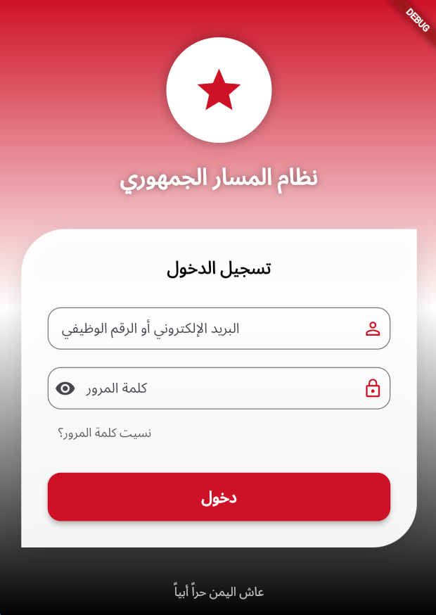

# 🇾🇪 نظام المسار الجمهوري - صفحة تسجيل الدخول

تتميز صفحة تسجيل الدخول في تطبيق "نظام المسار الجمهوري" بتصميم عصري يدمج بين الهوية الوطنية اليمنية وأحدث تقنيات تجربة المستخدم (UX) في Flutter.

## 📸 واجهة المستخدم
بإمكانك رؤية التصميم من خلال الصورة أدناه:



##  تفاصيل التصميم (UI)
* **الهوية البصرية:** تم استخدام ألوان العلم اليمني (الأحمر، الأبيض، الأسود) في الخلفية باستخدام تدرج لوني (Gradient) انسيابي يعزز الروح الوطنية.
* **التصميم التفاعلي:** تعتمد الصفحة على نظام الحواف المنحنية (Rounded Corners) للكارد الرئيسي لتعطي مظهراً مريحاً للعين.
* **الرموز الوطنية:** تم وضع شعار "النجمة" (أو نسر الجمهورية) في مقدمة الصفحة داخل إطار دائري مع تأثير الظلال لإبرازه.

## 🛠 المميزات التقنية
* **التفاعل الفيزيائي (3D Tilt Effect):** تم تغليف الكارد بـ `InteractivePushCard` الذي يجعل الواجهة تنحني وتغوص للداخل عند لمس الحواف، مما يعطي إحساساً بالاستجابة المادية.
* **إدارة الحالة (State Management):** تدعم حقول كلمة المرور ميزة إظهار وإخفاء النص بشكل سلس عبر `TextFormWidget`.
* **تجربة المستخدم (UX):** * دعم كامل للغة العربية (RTL).
    * تصميم متجاوب مع مختلف أحجام الشاشات باستخدام `SingleChildScrollView`.
    * استخدام أنظمة التحقق (Validation) لضمان صحة البيانات المدخلة.

##  كيفية الاستخدام
تأكد من وجود مسار الصورة بشكل صحيح في ملف `pubspec.yaml`:
```yaml
flutter:
  assets:
    - assets/login.png
